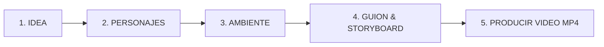
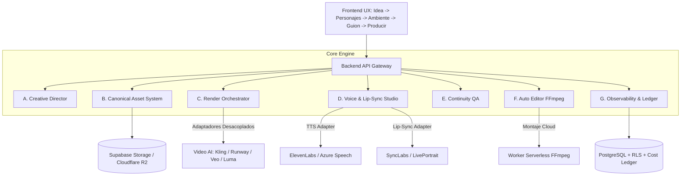
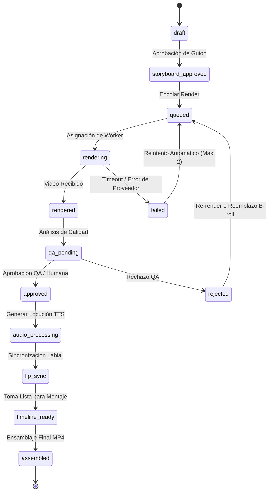

# PLAN DE IMPLEMENTACIÓN: LOOPGRAVITY PRODUCTION OS

> **Documento Oficial:** `PLAN_IMPLEMENTACION_LOOPGRAVITY_PRODUCTION_OS.md`  
> **Estado:** ARQUITECTURA EN DISEÑO — PENDIENTE DE APROBACIÓN  
> **Declaración de Principio:** *LOOPGRAVITY PRODUCTION OS — LA CONTINUIDAD SE RESUELVE POR PRODUCCIÓN, QA Y EDICIÓN; NO POR PROMPTS DE EXTENSIÓN DETERMINISTA N-1.*

---

## 1. Contexto, Decisión de Producto y Exclusiones Explícitas

Se ha validado mediante pruebas reales que los modelos generativos de video (Google Flow, Veo, Runway, Kling, Luma) no garantizan continuidad espacial o facial exacta a través de prompts de texto ni mecanismos de extensión $N-1$.

Por tanto:
- **LoopGravity deja de ser un generador de prompts.**
- **LoopGravity evoluciona hacia una PLATAFORMA DE PRODUCCIÓN AUDIOVISUAL CON IA.**
- Los modelos generativos son proveedores de render externos, intercambiables y no deterministas.

### Exclusiones Explícitas del Producto y del MVP
1. **No prometer continuidad exacta clip-a-clip desde prompts o Flow.**
2. **No usar extensiones $N-1$ como núcleo del sistema.**
3. **No considerar las suites de prompts (25/25) como certificación de calidad audiovisual real.**
4. **No incluir multi-escena compleja ni edición de línea de tiempo no lineal pesada en el navegador como bloqueante del MVP.**

---

## 2. Experiencia de Usuario Objetivo (UX Simple en 5 Pasos)

La interfaz principal elimina toda fricción técnica. Lentes, FPS, seeds, JSON, sliders y códigos de prompt quedan ocultos en un "Modo Avanzado" no visible por defecto.



### Especificación de Pasos UX

| Paso | Entradas Mínimas | Validaciones | Estado Persistido | Salida Generada | Fallbacks y Criterio UX |
| :--- | :--- | :--- | :--- | :--- | :--- |
| **1. Idea** | Pitch de 1-2 frases + Objetivo comercial. | Longitud > 10 caracteres. | `creative_briefs` | Logline, Tono, Target. | Propone 3 variantes si la idea es ambigua. |
| **2. Personajes** | Selección de 1 a 2 personajes del Catálogo canónico. | 1 o 2 personajes seleccionados. | `canonical_assets` | Ficha con foto canónica frontal, vestuario y voz asignada. | Asigna personajes pre-aprobados si el usuario no tiene imágenes. |
| **3. Ambiente** | Selección de Set/Escenario + Iluminación base. | 1 ambiente seleccionado. | `canonical_assets` | Set base con iluminación uniforme 5600K. | Set de oficina o estudio moderno por defecto. |
| **4. Guion** | Aprobación/Edición del guion de 3 a 5 tomas. | Diálogos $\le 15$ palabras por toma ($\le 2.5$ palabras/s). | `scripts`, `scenes`, `shots` | Storyboard con texto hablado, acción, tomas B-roll y CTA. | Contador de palabras/segundo para evitar desbordes de duración. |
| **5. Producir** | 1 Clic: "Producir Spot Comercial". | Saldo de créditos/presupuesto validado. | `render_jobs`, `timelines`, `exports` | Video MP4 final ensamblado con locución, lip-sync y subtítulos. | Si una toma visual falla, conmuta a B-roll de producto automáticamente. |

---

## 3. Módulos Obligatorios de la Plataforma



### A. Creative Director
- Transforma la idea en concepto comercial, estructura narrativa PAS/AIDA, shot list y CTA.
- Divide el spot en 3 a 5 tomas individuales (planos medios, primeros planos y planos detalle de producto B-roll).
- Limita estrictamente la cantidad de palabras habladas por toma para garantizar una cadencia de locución natural.
- Genera un storyboard validado antes de iniciar cualquier gasto de render.

### B. Canonical Asset System
- Repositorio versionado de activos de marca:
  - **Personajes:** Identidad visual inmutable, foto de referencia en alta resolución, vestuario canónico, ID de voz y restricciones.
  - **Producto:** Renders canónicos, paleta de color y logotipo en alta resolución.
  - **Ambiente:** Composición de set, iluminación clave difusa 5600K y paleta ambiental.
- Almacenamiento seguro en CDN con URLs firmadas temporales para proveedores externos.

### C. Render Orchestrator (Multi-Provider con Desacoplamiento)
- **Filosofía:** No promete continuidad exacta; orquesta renders de tomas independientes y planos de cobertura.
- Adaptadores desacoplados con arquitectura extensible (`RunwayAdapter`, `KlingAdapter`, `VeoAdapter`, `LumaAdapter`).
- Gestión de colas asíncronas, webhooks/polling, idempotencia, timeouts (máx 15 min), reintentos con backoff exponencial y cancelación de tareas.
- Registro estricto de parámetros, costos estimados y reales por toma.

### D. Voice & Lip-Sync Studio (Audio Desacoplado)
- **Locución TTS Separada:** Generación de voz previa en español latinoamericano (ElevenLabs) con control de pausas y emociones.
- **Sincronización Labial Post-Render:** Proceso secundario aplicado sobre el video aprobado usando el audio de voz generado (SyncLabs).
- **Pistas de Audio Aisladas:** Voz, música de fondo (BGM) y efectos sonoros (SFX) como canales independientes para mezcla en el editor.

### E. Continuity QA (Control de Calidad Híbrido)
- Comparación algorítmica y visual contra los activos canónicos (rostro, ropa, producto, deformidades).
- Entrega un score de calidad explicable por toma (0–100).
- **Revisión Humana Obligatoria:** Semáforo de decisión:
  1. *Aprobar toma.*
  2. *Reintentar render.*
  3. *Reemplazar por B-roll de Producto / Escenario.*
  4. *Cambiar ángulo o encuadre.*

### F. Auto Editor & Ensamblaje en la Nube
- Montaje automatizado en worker serverless con **FFmpeg**:
  - Concatenación de tomas aprobadas.
  - Inserción de tomas B-roll de producto para cubrir cortes entre personajes.
  - Mezcla de audio (Voz al 100%, BGM al 12%, SFX nivelados).
  - Generación y quemado de subtítulos sincronizados (SRT/VTT).
  - Placa final con CTA y logotipo.
- Exportación del archivo maestro **MP4 (1080p, 24fps)** y exportación opcional de timelines **OTIO / FCPXML**.

### G. Observabilidad, Costos y Seguridad
- Multi-tenancy real con Supabase Auth, PostgreSQL RLS y Storage aislado.
- Libro mayor de costos (`cost_ledger`) en centavos de USD en tiempo real.
- Bloqueo de generación ante saldo insuficiente o desborde de presupuesto por proyecto.
- Protección y privacidad de imágenes de personas y datos de clientes.

---

## 4. Ciclo de Vida de una Toma (Shot State Machine)



---

## 5. Esquema de Base de Datos PostgreSQL & RLS

```sql
-- Extensiones
CREATE EXTENSION IF NOT EXISTS "uuid-ossp";

-- 1. Tenants / Organizaciones
CREATE TABLE public.organizations (
    id UUID PRIMARY KEY DEFAULT uuid_generate_v4(),
    name VARCHAR(255) NOT NULL,
    slug VARCHAR(100) UNIQUE NOT NULL,
    credit_balance_cents BIGINT DEFAULT 5000,
    created_at TIMESTAMPTZ DEFAULT NOW(),
    updated_at TIMESTAMPTZ DEFAULT NOW()
);

-- 2. Usuarios y Membresías
CREATE TABLE public.users (
    id UUID PRIMARY KEY,
    email VARCHAR(255) NOT NULL,
    full_name VARCHAR(255),
    created_at TIMESTAMPTZ DEFAULT NOW()
);

CREATE TABLE public.organization_members (
    id UUID PRIMARY KEY DEFAULT uuid_generate_v4(),
    organization_id UUID NOT NULL REFERENCES public.organizations(id) ON DELETE CASCADE,
    user_id UUID NOT NULL REFERENCES public.users(id) ON DELETE CASCADE,
    role VARCHAR(50) DEFAULT 'member' CHECK (role IN ('owner', 'admin', 'member')),
    created_at TIMESTAMPTZ DEFAULT NOW(),
    UNIQUE(organization_id, user_id)
);

-- 3. Proyectos
CREATE TABLE public.projects (
    id UUID PRIMARY KEY DEFAULT uuid_generate_v4(),
    organization_id UUID NOT NULL REFERENCES public.organizations(id) ON DELETE CASCADE,
    title VARCHAR(255) NOT NULL,
    target_duration_seconds INTEGER DEFAULT 30,
    aspect_ratio VARCHAR(10) DEFAULT '16:9',
    status VARCHAR(50) DEFAULT 'draft',
    created_at TIMESTAMPTZ DEFAULT NOW(),
    updated_at TIMESTAMPTZ DEFAULT NOW()
);

-- 4. Activos Canónicos (Personajes, Vestuario, Productos, Ambientes)
CREATE TABLE public.canonical_assets (
    id UUID PRIMARY KEY DEFAULT uuid_generate_v4(),
    organization_id UUID NOT NULL REFERENCES public.organizations(id) ON DELETE CASCADE,
    asset_type VARCHAR(50) NOT NULL CHECK (asset_type IN ('character', 'outfit', 'product', 'environment', 'audio_voice')),
    name VARCHAR(255) NOT NULL,
    reference_image_url TEXT,
    voice_id VARCHAR(100),
    attributes_json JSONB DEFAULT '{}'::jsonb,
    is_active BOOLEAN DEFAULT TRUE,
    created_at TIMESTAMPTZ DEFAULT NOW()
);

-- 5. Guiones y Tomas (Shots)
CREATE TABLE public.scripts (
    id UUID PRIMARY KEY DEFAULT uuid_generate_v4(),
    project_id UUID NOT NULL REFERENCES public.projects(id) ON DELETE CASCADE,
    organization_id UUID NOT NULL REFERENCES public.organizations(id) ON DELETE CASCADE,
    logline TEXT,
    target_audience TEXT,
    cta_text TEXT,
    version INTEGER DEFAULT 1,
    created_at TIMESTAMPTZ DEFAULT NOW()
);

CREATE TABLE public.shots (
    id UUID PRIMARY KEY DEFAULT uuid_generate_v4(),
    script_id UUID NOT NULL REFERENCES public.scripts(id) ON DELETE CASCADE,
    project_id UUID NOT NULL REFERENCES public.projects(id) ON DELETE CASCADE,
    organization_id UUID NOT NULL REFERENCES public.organizations(id) ON DELETE CASCADE,
    shot_order INTEGER NOT NULL,
    shot_type VARCHAR(50) NOT NULL,
    character_1_id UUID REFERENCES public.canonical_assets(id),
    character_2_id UUID REFERENCES public.canonical_assets(id),
    product_id UUID REFERENCES public.canonical_assets(id),
    environment_id UUID REFERENCES public.canonical_assets(id),
    action_description TEXT NOT NULL,
    dialogue_es TEXT,
    speaker_asset_id UUID REFERENCES public.canonical_assets(id),
    duration_seconds NUMERIC(4,2) DEFAULT 6.0,
    status VARCHAR(50) DEFAULT 'draft',
    created_at TIMESTAMPTZ DEFAULT NOW()
);

-- 6. Renders, Audio y Lip-Sync
CREATE TABLE public.render_jobs (
    id UUID PRIMARY KEY DEFAULT uuid_generate_v4(),
    shot_id UUID NOT NULL REFERENCES public.shots(id) ON DELETE CASCADE,
    organization_id UUID NOT NULL REFERENCES public.organizations(id) ON DELETE CASCADE,
    provider VARCHAR(50) NOT NULL,
    model_version VARCHAR(50) NOT NULL,
    prompt_payload JSONB NOT NULL,
    status VARCHAR(50) DEFAULT 'queued',
    external_job_id VARCHAR(255),
    output_video_url TEXT,
    cost_cents INTEGER DEFAULT 0,
    error_message TEXT,
    attempt_count INTEGER DEFAULT 1,
    created_at TIMESTAMPTZ DEFAULT NOW(),
    updated_at TIMESTAMPTZ DEFAULT NOW()
);

CREATE TABLE public.voice_jobs (
    id UUID PRIMARY KEY DEFAULT uuid_generate_v4(),
    shot_id UUID NOT NULL REFERENCES public.shots(id) ON DELETE CASCADE,
    organization_id UUID NOT NULL REFERENCES public.organizations(id) ON DELETE CASCADE,
    provider VARCHAR(50) DEFAULT 'elevenlabs',
    voice_id VARCHAR(100) NOT NULL,
    text_content TEXT NOT NULL,
    audio_url TEXT,
    duration_seconds NUMERIC(4,2),
    status VARCHAR(50) DEFAULT 'queued',
    created_at TIMESTAMPTZ DEFAULT NOW()
);

CREATE TABLE public.lip_sync_jobs (
    id UUID PRIMARY KEY DEFAULT uuid_generate_v4(),
    render_job_id UUID NOT NULL REFERENCES public.render_jobs(id) ON DELETE CASCADE,
    voice_job_id UUID NOT NULL REFERENCES public.voice_jobs(id) ON DELETE CASCADE,
    organization_id UUID NOT NULL REFERENCES public.organizations(id) ON DELETE CASCADE,
    provider VARCHAR(50) DEFAULT 'synclabs',
    output_video_url TEXT,
    status VARCHAR(50) DEFAULT 'queued',
    created_at TIMESTAMPTZ DEFAULT NOW()
);

-- 7. Montaje Final y Costos
CREATE TABLE public.timelines (
    id UUID PRIMARY KEY DEFAULT uuid_generate_v4(),
    project_id UUID NOT NULL REFERENCES public.projects(id) ON DELETE CASCADE,
    organization_id UUID NOT NULL REFERENCES public.organizations(id) ON DELETE CASCADE,
    master_mp4_url TEXT,
    otio_content JSONB,
    fcpxml_content TEXT,
    subtitles_vtt TEXT,
    status VARCHAR(50) DEFAULT 'draft',
    created_at TIMESTAMPTZ DEFAULT NOW()
);

CREATE TABLE public.cost_ledger (
    id UUID PRIMARY KEY DEFAULT uuid_generate_v4(),
    organization_id UUID NOT NULL REFERENCES public.organizations(id) ON DELETE CASCADE,
    project_id UUID REFERENCES public.projects(id),
    job_type VARCHAR(50) NOT NULL,
    job_id UUID NOT NULL,
    amount_cents INTEGER NOT NULL,
    currency VARCHAR(10) DEFAULT 'USD',
    description TEXT,
    created_at TIMESTAMPTZ DEFAULT NOW()
);

-- RLS
ALTER TABLE public.organizations ENABLE ROW LEVEL SECURITY;
ALTER TABLE public.projects ENABLE ROW LEVEL SECURITY;
ALTER TABLE public.canonical_assets ENABLE ROW LEVEL SECURITY;
ALTER TABLE public.scripts ENABLE ROW LEVEL SECURITY;
ALTER TABLE public.shots ENABLE ROW LEVEL SECURITY;
ALTER TABLE public.render_jobs ENABLE ROW LEVEL SECURITY;
ALTER TABLE public.voice_jobs ENABLE ROW LEVEL SECURITY;
ALTER TABLE public.lip_sync_jobs ENABLE ROW LEVEL SECURITY;
ALTER TABLE public.timelines ENABLE ROW LEVEL SECURITY;
ALTER TABLE public.cost_ledger ENABLE ROW LEVEL SECURITY;

CREATE POLICY "Tenant Isolation: Projects" ON public.projects
    FOR ALL USING (organization_id IN (
        SELECT organization_id FROM public.organization_members WHERE user_id = auth.uid()
    ));

CREATE POLICY "Tenant Isolation: Assets" ON public.canonical_assets
    FOR ALL USING (organization_id IN (
        SELECT organization_id FROM public.organization_members WHERE user_id = auth.uid()
    ));

CREATE POLICY "Tenant Isolation: Shots" ON public.shots
    FOR ALL USING (organization_id IN (
        SELECT organization_id FROM public.organization_members WHERE user_id = auth.uid()
    ));

CREATE POLICY "Tenant Isolation: Timelines" ON public.timelines
    FOR ALL USING (organization_id IN (
        SELECT organization_id FROM public.organization_members WHERE user_id = auth.uid()
    ));

CREATE POLICY "Tenant Isolation: Cost Ledger" ON public.cost_ledger
    FOR ALL USING (organization_id IN (
        SELECT organization_id FROM public.organization_members WHERE user_id = auth.uid()
    ));
```

---

## 6. Matriz de Decisiones Tecnológicas

| Área | Decisión Recomendada | Justificación Técnica |
| :--- | :--- | :--- |
| **Frontend** | **Next.js 15 (App Router)** | Renderizado híbrido, Server Actions seguros para credenciales y panel UX reactivo sin recarga. |
| **Colas Asíncronas** | **Inngest / BullMQ** | Soporte de workflows multi-paso de larga duración (renders de 5-10 min), reintentos y webhooks. |
| **Storage & CDN** | **Cloudflare R2 + Supabase Storage** | Zero egress fees para streaming de videos MP4 y URLs firmadas de alta velocidad. |
| **Proveedor TTS** | **ElevenLabs** | Calidad vocal hiperrealista en español latinoamericano, clonación y control estricto de pausas. |
| **Proveedor Lip-Sync** | **SyncLabs API** | Mapeo labial sobre video ya renderizado con alta fidelidad facial sin deformaciones. |
| **Proveedor Video Inicial**| **Kling 1.5 / Runway Gen-3** | API programática oficial para renders por toma independiente con Start Frames confiables. |
| **Motor de Montaje** | **Worker Serverless FFmpeg** | Máxima velocidad, bajo costo y control exacto de pistas, B-roll, subtítulos y exportación MP4. |

---

## 7. Primer Vertical (MVP Real) — Alcance Estricto

* **Formato:** 16:9 (1920x1080).
* **Duración:** 20 a 30 segundos (4 a 5 tomas de 5 a 6s cada una).
* **Elenco:** Máximo 2 personajes con foto canónica.
* **Producto & Set:** 1 producto digital/físico y 1 ambiente de estudio.
* **Idioma:** Español latinoamericano.
* **Audio:** Locución TTS separada + BGM sutil + subtítulos quemados automáticos.
* **Revisión Humana:** Aprobación por semáforo antes de ensamblar el MP4 final.
* **Entregables de Evidencia:** Archivo MP4 descargable, registro en `cost_ledger`, timeline y logs de ejecución.

---

## 8. Plan de Implementación por Fases

| Fase | Nombre | Entregables y Dependencias | Criterio de Aceptación (DoD) |
| :--- | :--- | :--- | :--- |
| **Fase 0** | Discovery & Validación de Proveedores | Benchmarks de latencia y pruebas de API (Kling/Runway, ElevenLabs, SyncLabs). | 3 tomas de prueba renderizadas exitosamente vía API externa. |
| **Fase 1** | Núcleo de Datos, Auth, RLS y Activos | Migraciones PostgreSQL en Supabase, RLS activo y módulo de Activos Canónicos. | Aislamiento multi-tenant validado con tests de integración (0 fugas). |
| **Fase 2** | Creative Director & Storyboard | Generador de guiones en 4 tomas con límite de palabras/segundo y storyboard. | Guion de 25s generado con diálogos y acciones asignadas a personajes. |
| **Fase 3** | Render Orchestrator | Worker asíncrono para render de tomas independientes con manejo de reintentos. | Renders de tomas completados y almacenados en R2 sin bloqueos. |
| **Fase 4** | Voice Studio & Lip-Sync | Generación de audio TTS en español latino y sincronización labial post-render. | Pista de voz limpia y visemas labiales sincronizados en cámara. |
| **Fase 5** | Continuity QA & Revisión Humana | Panel de control de calidad con score y semáforo de aprobación manual. | Operador aprueba o reemplaza tomas con B-roll antes del ensamble. |
| **Fase 6** | Auto Editor & Exportación MP4 | Worker FFmpeg que ensambla tomas, mezcla audio, inserta subtítulos y genera MP4. | Video final MP4 1080p de 25s descargable y reproducible al 100%. |
| **Fase 7** | Observabilidad, Costos y Despliegue | `cost_ledger` en vivo, bloqueo por presupuesto y lanzamiento controlado. | 1 spot comercial completo producido de extremo a extremo con costos auditados. |

---

## 9. Checklist de "Definition of Done" (DoD) para el Primer Spot Real

- [ ] Proyecto creado con el flujo simple de 5 pasos (`Idea -> Personajes -> Ambiente -> Guion -> Producir`).
- [ ] Personajes y Producto cargados con referencias canónicas inmutables.
- [ ] 4 tomas renderizadas de forma independiente por el Render Orchestrator.
- [ ] Locución en español latino generada por ElevenLabs con pista de audio aislada.
- [ ] Sincronización labial (Lip-Sync) aplicada sobre los primeros planos aprobados.
- [ ] Ensamblaje FFmpeg completado con música de fondo (BGM) y subtítulos automáticos.
- [ ] Video final MP4 1080p generado y verificado visualmente por un humano.
- [ ] Costo total de GPU y tokens registrado en `cost_ledger`.
